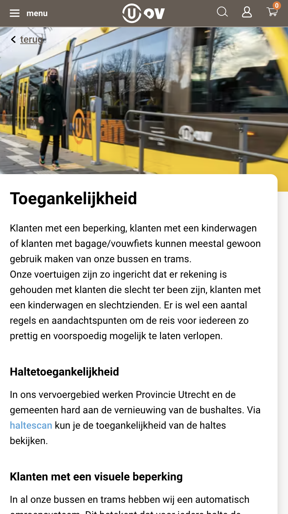
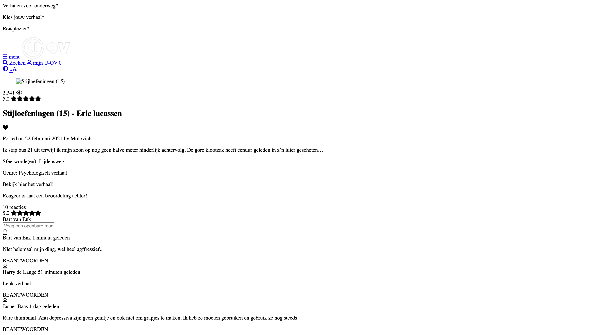

# **Frontend development blok 1 voor studioinhalers - Proces verslag**

Auteur: Jesse Welleman
Website: https://wellouman.github.io/FrontendHER/

————————————————————————————————————————————————————————————————————————————————————————————————————————————

## **Bronnenlijst**

1. https://jigsaw.w3.org/css-validator/validator-
2. https://www.u-ov.info/
3. https://developer.mozilla.org/en-US/docs/Web/CSS/max-width-
4. https://css-tricks.com/snippets/css/complete-guide-grid/-
5. https://css-tricks.com/snippets/css/a-guide-to-flexbox/-
6. https://www.w3schools.com/css/css3_mediaqueries_ex.asp
7. https://developer.mozilla.org/en-US/docs/Web/CSS/Pseudo-classes-
8. https://www.w3schools.com/tags/ref_pxtoemconversion.asp-
9. https://web.dev/patterns/layout/
10. https://dlo.mijnhva.nl/d2l/le/content/286174/Home-

————————————————————————————————————————————————————————————————————————————————————————————————————————————

## **Intake opdracht - week 1**

Je startniveau: Blauw/Rood

Je focus: Responsive

Je opdracht: De website https://www.u-ov.info/ veranderen in een website waar je korte verhaaltjes kan lezen tijdens je rit met het openbaar vervoer. 

Screenshot(s) van de eerste pagina (small screen):

Desktop scherm 1:

Tablet scherm 1:



Mobile scherm 1:

Desktop scherm 2:


Tablet scherm 2:


Mobile scherm 2:



————————————————————————————————————————————————————————————————————————————————————

## **Breakdown schets - week 1**

Breakdownschets 1: Alle content


Breakdownschets 2: Header

Breakdownschets 3: Main


Breakdownschets 4: Footer



————————————————————————————————————————————————————————————————————————————————————

## **Voortgang 1 HTML - week 3**

Alle HTML is geschreven en voor twee pagina’s was dat niet heel erg lastig of tijdrovend. Gelukkig is dit iets wat ik in jaar 2 (2018-2019) al voldoende had afgesloten dus hier hoefde niet heel veel meer aan gedaan te worden. 







————————————————————————————————————————————————————————————————————————————————————

## **Voortgang 2 Mobile css - week 3 en 4**

Uiteraard gaan we er allereerst voor zorgen dat de website er op mobiel goed uit gaat zien met behulp van css. Dit is niet altijd even soepel gegaan. De zwarte header en menubalk was behoorlijk makkelijk en was daarom erg snel voor elkaar. Het genereren van een random verhaal was wel een stuk moeilijker om css voor te schrijven, laat staan de javascript die geschreven moet worden.

Uiteindelijk is het gelukt met display grid!  



## **Voortgang 3 Mobile css - week 5**

Na de uren die het heeft geduurd om de genereer functie te maken kreeg ik de grid en flexbox techniek behoorlijk onder de knie. Uiteraard nog wat moeilijkheden en brainfreezes tijdens de rest van de mobiele website maar uiteindelijk is dit allemaal goed gekomen. Een artikel was bijvoorbeeld best lastig met alle info die op specifieke plekken moest komen te staan. Er is gebruik gemaakt van een 1 row grid voor de mobiele versie die komende week veranderd gaat worden door middel van media queries. 



## **Voortgang 4 Mediaqueries - week 5 & 6**

Veel content gaat automatisch responsive door middel van display grid en flexbox en het meegeven van procentuele waardes voor de grootte van elementen:

- Positionering van de artikelen
- Content binnen de artikelen 
- Header en navigatie elementen
- Content binnen de genereer functie
- Grootte van bepaalde elementen

Er zijn een aantal elementen in de website die media queries nodig hebben om er responsieve goed uit te zien. Op desktop heb je meer ruimte op je mobiel en daarom kan je ook meer content laten zien. De volgende media queries zijn gebruikt om de pagina er zo goed mogelijk uit te laten zien:

- @media screen and (min-width: 728px)

	728 en groter zorgt ervoor dat het genereer element de ruimte gaat innemen die mogelijk is. De uitklapbare genereer functie op mobile wordt omgezet naar een normale display. Uitklappen in de ruimte die 	het nu heeft is niet meer nodig.  



—>



- @media screen and (min-width: 920px)

	Veranderen van grid binnen de genereer functie van 2 rijen naar 3. 
	Genereer button moet onder derde rij komen te staan. 



- @media screen and (min-width: 1035px)

	Filters veranderen van desktop naar mobiele versie. 



—>





## **Voortgang 5 Javascript - week 7 & 8**

Hoewel coderen mij niet heel erg ligt ging dit mij best goed af. Ik werk op een webdesign bureau en de developer heeft mij af en toe kunnen helpen. De volgende elementen zijn gemaakt door middel van javascript:

- Openen van de genereer functie op mobile
- Liken van de artikelen. 
- Likes toevoegen aan nummer naast mijn u-ov. 
- Klikken op filters binnen de genereer functie. 
- Artikel genereren binnen de genereer functie. 
